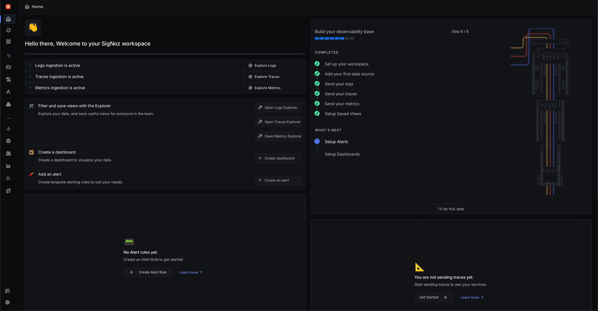
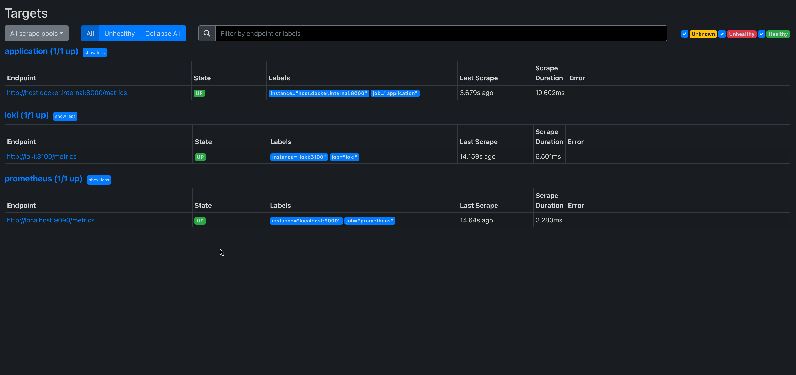

# Observability Comparison PoC

## Introduction

Observability Setup and Value Comparison PoC between SigNoz and Prometheus, Grafana and Loki stack. This setup enables user to compare the effort requirements, ease of use, maintainability and overall value between different self-hosted observability stacks.

Stack A is SigNoz, built on OpenTelemetry standards, enabling end-to-end observability out of the box.
Stack B uses Prometheus, Grafana and Loki and requires additional setup to enable metrics and logs coverage.

To keep the demonstration straightforward and to ensure separation of concerns, the application supports usage of only one stack at a time.

## Usage Guide

### SigNoz Setup

First, start the self-hosted SigNoz stack, we will later add our application to this docker network:

```bash
docker compose -f signoz/deploy/docker/docker-compose.yaml up -d --remove-orphans
```

Start the Python application and add it to the stack's external network. Add `sudo` before the command, if you get a permission denied error for `--build`:

```bash
docker compose up -d --build && docker network connect signoz-net python_app
```

Access the SigNoz application at `http://localhost:8080`, create login credentials and you can now start using it for your observability needs.



### Prometheus-Grafana-Loki Setup

First, start the self-hosted Prometheus-Grafana-Loki stack, we will later add our application to this docker network:

```bash
docker compose -f grafana-stack/docker-compose.yaml up -d
```

Start the Python application and add it to the stack's external network. Add `sudo` before the command, if you get a permission denied error for `--build`:

```bash
OBSERVABILITY_BACKEND=grafana-stack docker compose up -d --build && docker network connect grafana-stack python_app
```

Visit `http://localhost:9090/targets?search=` to access the Prometheus application, and check if all the targets are being scraped from. Refresh the page as it may take some time.

Once done, you should see all targets being up:



Access the Grafana application at `http://localhost:3000`, login with `admin` as username and password.

#### Integrating Data Sources into Grafana

Next, select `Data Sources` from the left navigation menu, and click on `Add data source`.
Select `Prometheus` as the data source type, and enter `http://localhost:9090` as the URL.
Click on `Save & Test` to save the data source.

Select `Data Sources` from the left navigation menu, and click on `Add data source`.
Select `Loki` as the data source type, and enter `http://localhost:3100` as the URL.
Click on `Save & Test` to save the data source.

You have now configured `Loki` for logs and `Prometheus` for metrics ingestion, for visualization in Grafana, and can now start using it for your observability needs.

### Generating Data for Visualization

Please ensure you have `locust` installed on your system. Then run the command:

```bash
locust -f locustfile.py --headless -u 20 -r 2 --run-time 1m
```

This will simulate 20 load of users for 1 minute, you may configure values based on your needs.

### Stopping the Services

To stop the SigNoz stack:

```bash
docker compose -f signoz/deploy/docker/docker-compose.yaml down
```

To stop the Prometheus-Grafana-Loki stack:

```bash
docker compose -f grafana-stack/docker-compose.yaml down
```
